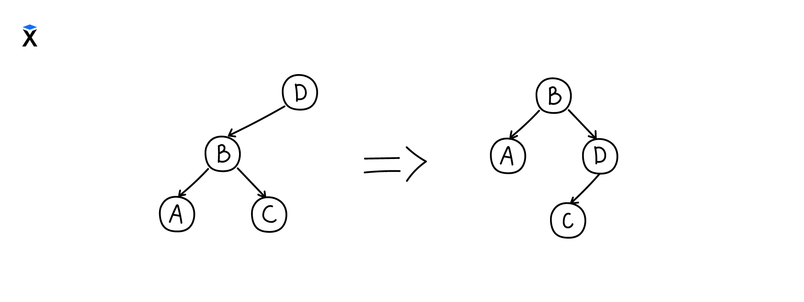
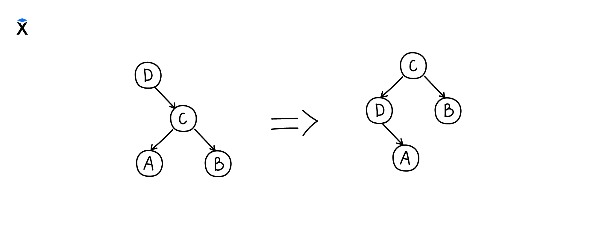

lab2
=====
- Студент: ``` Михайлов Павел ```
- ИСУ: ``` 367403 ```
- Вариант: ``` Binary Tree Dict ```
  
##  Test values:

```
T1 = lab2:insert(10, 10, lab2:empty()).
T2 = lab2:insert(5, 5, T1).    
T3 = lab2:insert(6, 6, T2).
T4 = lab2:insert(3, 3, T3).
T5 = lab2:insert(4, 4, T4).
T6 = lab2:insert(2, 2, T5).
T7 = lab2:insert(1, 1, T6).
```

```
T1 = balance_tree:insert_and_balance(1, 1, lab2:empty()).
T2 = balance_tree:insert_and_balance(3, 3, T1).
T3 = balance_tree:insert_and_balance(10, 10, T2).
T4 = balance_tree:insert_and_balance(5, 5, T3).
T5 = balance_tree:insert_and_balance(7, 7, T4).
T6 = balance_tree:insert_and_balance(9, 9, T5).
T7 = balance_tree:insert_and_balance(11, 11, T6).
T8 = balance_tree:insert_and_balance(100, 100, T7).
T9 = balance_tree:insert_and_balance(50, 50, T8).
```

## Balance rules
Ребалансировка деревьев осуществляется при помощи специальных механизмов — методов вращения. Вращения бывают двух видов: левое и правое.

Вращение вправо выполняется за три шага:

- Текущий корень поддерева (D) заменяется на левый дочерний узел (B)

- Предыдущий корень (D) становится правым дочерним узлом для (B)

- Предыдущее правое поддерево узла (B) становится левым поддеревом для (D)



Вращение влево выполняется аналогично:

- Текущий корень поддерева (D) заменяется на правый дочерний узел ©

- Предыдущий корень (D) становится левым дочерним узлом для ©

- Предыдущее левое поддерево узла © становится правым поддеревом для (D)




## Functions:

- добавление и удаление элементов;
``` erlang
1> T1 = lab2:insert(10, 10, lab2:empty()).
{node,10,10,{node,nil},{node,nil}}
2> T2 = lab2:insert(5, 5, T1).    
{node,10,10,{node,5,5,{node,nil},{node,nil}},{node,nil}}
3>    
3> T3 = lab2:insert(11, 11, T2).
{node,10,10,
      {node,5,5,{node,nil},{node,nil}},
      {node,11,11,{node,nil},{node,nil}}}

4> lab2:remove(10, T3).
{node,5,5,{node,nil},{node,11,11,{node,nil},{node,nil}}}

```
- фильтрация;
```
...
18> T9 = balance_tree:insert_and_balance(50, 50, T8).
{node,10,10,
      {node,7,7,
            {node,3,3,
                  {node,1,1,{node,nil},{node,nil}},
                  {node,5,5,{node,nil},{node,nil}}},
            {node,9,9,{node,nil},{node,nil}}},
      {node,11,11,
            {node,nil},
            {node,100,100,
                  {node,50,50,{node,nil},{node,nil}},
                  {node,nil}}}}
19>lab2:filter_tree(T9, fun ({Key, _}) -> Key > 20 end).  
{node,50,50,{node,nil},{node,100,100,{node,nil},{node,nil}}}
```
- свертки (левая и правая);
``` erl
create_tree_from_list_foldl(List) ->
    lists:foldl(fun insert/2, empty(), List).

create_tree_from_list_foldr(List) ->
    lists:foldr(fun insert/2, empty(), List).
```
- структура должна быть моноидом.
    Операцией над множеством будет merge деревьев.
  1) Ассоциативность
    ```
    6> T1.
    {node,5,5,{node,nil},{node,nil}}
    7> T2.
    {node,3,3,{node,nil},{node,nil}}
    9> T5 = lab2:insert(8, 8, T3).
    {node,9,9,{node,8,8,{node,nil},{node,nil}},{node,nil}}
    10> lab2:merge_trees(lab2:merge_trees(T1, T2), T5) == lab2:merge_trees(T1, lab2:merge_trees(T2, T5)).
    true
    ```
   2) Нейтральный элемент {node, 'nil'}
    ```
    11> lab2:empty().
    {node,nil}
    12> lab2:merge_trees(lab2:empty(), T5).                                                              
    {node,8,8,{node,nil},{node,9,9,{node,nil},{node,nil}}}
    13> lab2:merge_trees(lab2:empty(), T5) == lab2:merge_trees(T5, lab2:empty()).
    true
    ```

    ## Вывод

В результате выполнения данной лабораторной работы были получены навыки работы с неизменямыми структурами данных в функциональном языке программирования, без хранения состояния, а также вручную реализованы функции высшего порядка.

